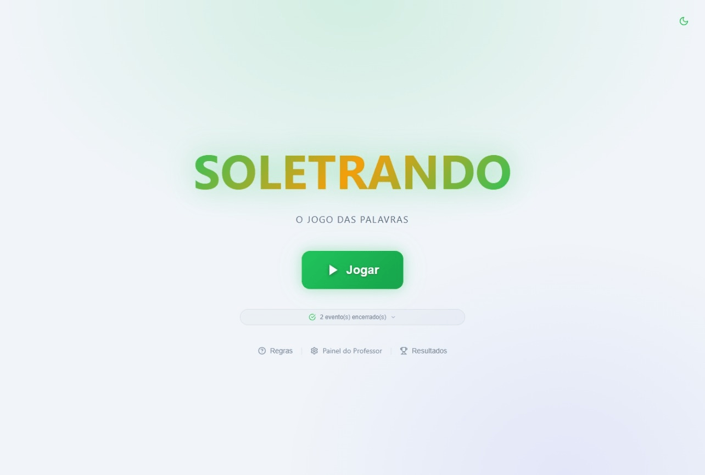

# 📚 Soletrando — O Jogo das Palavras

> Jogo de soletração para a sala de aula. O professor seleciona série, turmas e disciplinas, o aluno **fala** as letras em voz alta e o professor digita cada letra no teclado. Sem cronômetro, sem pressão — puro treino de ortografia.

Funciona 100% no navegador, **sem instalação e sem servidor** (os dados ficam salvos localmente no seu computador).

---

## 🖼️ Demonstração

| Modo claro | Modo escuro |
|---|---|
|  |  |

---

## ✨ Funcionalidades

### 🎮 Para o Jogo (alunos + professor)

- **Soletração guiada por série, turma e disciplina** — seleção em etapas: Série → Turma(s) → Disciplina(s).
- **Digitação de uma letra por vez** — o professor registra a letra que o aluno falou; validação imediata de acerto/erro.
- **Suporte a acentos** (A ≠ Ã, obrigatórios) e **hífens** (soletrados como parte da palavra).
- **Modo Ensaio** (`Modo Ensaio` antes de iniciar) — jogo sem registrar nos resultados, ideal para treinar.
- **Distribuição de palavras**:
  - **Total de palavras** — usa todas as palavras disponíveis.
  - **Por disciplina** — distribui uma quantidade por disciplina.
- **Ordem dos alunos**:
  - **Turma por turma** (sequencial) — completa cada turma antes de passar à próxima.
  - **Intercalado** — alterna entre as turmas.
- **Dica e ilustração opcionais** durante a palavra (botões na tela do jogo ou ativadas por padrão nas configurações).
- **Contador de palavras restantes**, **cronômetro** (opcional) e botão **"+1 Palavra"** para estender o limite durante a rodada.
- **Sessão anterior recuperável** — se a página fechar no meio, o jogo oferece "Continuar" ou "Nova Sessão".
- **Painel de erro didático** — mostra a letra digitada vs. esperada e revela a palavra correta (opcional).
- **Tela cheia, tema claro/escuro, efeitos sonoros e confete** no fim da sessão.
- **Resultado da sessão** com total, acertos, erros, taxa de acerto, lista detalhada de palavras e acesso ao histórico completo.

### 🌍 Idiomas (troca de idioma)

- **Três idiomas disponíveis**: Português (Brasil), English e Español — troca instantânea no seletor de idioma (Painel do Professor → Configurações → Idioma) ou pelo botão de globo na tela.
- **Preferência persistida** — o idioma escolhido fica salvo e é aplicado automaticamente na próxima abertura; a detecção inicial usa o idioma do navegador (`pt-BR`, `en` ou `es`).
- **Interface 100% traduzida** — telas, botões, menus, mensagens de erro, resumo de sessão e painel do professor.
- **Tradução de logs históricos** — os registros do **Log de Atividades** e dos **Resultados** (gravados em português) são traduzidos na hora para o idioma ativo, preservando os dados originais.
- **Arquivos de idioma independentes** — cada idioma tem seu dicionário em `js/language/`, facilitando adicionar novas traduções.

### 🏆 Eventos (gincanas escolares)

- Criação de **eventos com múltiplas rodadas** (ex.: Feira de Agosto).
- Cada rodada tem: **série, turma, disciplinas, nº de palavras por aluno, modo (sorteio/seleção), lista de palavras selecionadas e alunos participantes**.
- **Fluxo guiado**: resumo do evento → rodada atual → fim da rodada → transição → fim do evento.
- **Banner na página inicial** com eventos de hoje, futuros, sem data e histórico de encerrados (eventos encerrados ficam visíveis por **7 dias** após o encerramento).
- Encerramento/reabertura manual no painel e **encerramento automático** quando a data passa.
- Resultados por evento e por execução.

### 📊 Resultados e Estatísticas

- **Hall da Fama** com pódio de alunos (em eventos) e de séries (acertos por turma/série).
- **Taxa de acerto por disciplina** em gráfico de barras.
- Cards de estatísticas (total, acertos, erros, taxa).
- **Histórico completo** das partidas (avulsas e de eventos) com data, hora, palavra, erro, disciplina, série e tempo.
- Limpeza total dos resultados (avulsos ou de eventos) com confirmação.

### 🧑‍🏫 Painel do Professor (CRUD completo)

| Seção | O que faz |
|---|---|
| **Séries** | Criar, editar, excluir e adicionar em lote. |
| **Disciplinas** | Criar, editar, excluir e adicionar em lote; vincular a séries. |
| **Palavras** | Criar, editar, excluir e adicionar em lote; **upload de imagem** com ajuste de recorte/zoom; filtros por série e disciplina. |
| **Eventos** | Criar eventos com múltiplas rodadas completas; encerrar/reabrir/excluir/duplicar. |
| **Resultados Avulsos** | Estatísticas, pódios e histórico das partidas fora de eventos. |
| **Resultados de Eventos** | Filtrar por evento e execução; mesmos painéis de estatísticas. |
| **Configurações** | Ver tabela de personalização abaixo. |
| **Exportar / Importar** | Backup ZIP, importação, pasta do sistema e migração de imagens. |
| **Log de Atividades** | Registro de criar/editar/excluir com filtros e busca; exportação em CSV. |

### 🛠️ Exportar, Importar e Backup

- **Exportar Tudo (ZIP)** — baixa toda a configuração incluindo imagens.
- **Importar** — de arquivo `.zip` ou `.json`:
  - **Sobrescrever Tudo** (faz backup automático antes);
  - **Escolher o que importar** (séries, turmas, disciplinas, palavras, eventos, resultados, logs, configurações) com modo de conflito: **Sobrescrever / Ignorar / Atualizar**.
- **Pasta do Sistema** — conecta a pasta onde ficam os arquivos do jogo para salvar backups, imagens e configurações de forma persistente.
- **Migrar Imagens** — copia imagens que estão fora da pasta `img` (links externos e embutidas) para a pasta do sistema.
- **Backup Local** — salva/lista/restaura/exclui backups completos na pasta `backups` (o backup automático também é feito antes de importações/restaurações destrutivas).
- **Restauração** — total ou seletiva, com os mesmos modos de conflito da importação.

---

## ⚙️ Personalização (Painel do Professor → Configurações)

### Jogo
| Opção | Descrição |
|---|---|
| Capitalização das Letras | `MAIÚSCULO` / `minúsculo` / `Capitalizado`. |
| Mostrar dica desde o início | Exibe a dica da palavra já na primeira letra. |
| Mostrar imagem desde o início | Exibe a ilustração já na primeira letra. |
| Mostrar quantidade de palavras restantes | Contador visível durante a partida. |
| Mostrar cronômetro no jogo | Liga/desliga o timer. |
| Revelar palavra correta ao errar | Mostra a palavra completa no momento do erro. |
| Modo Automático | Envia a letra sem precisar apertar Enter. |

### Efeitos
| Opção | Descrição |
|---|---|
| Confete ao acertar | Animação de confete a cada acerto. |
| Chacoalhar ao errar | Animação de "shake" ao errar. |
| Animação das letras | `Zoom` / `Fade` / `Deslizar`. |
| Som de acerto / erro / celebração | Liga ou desliga cada efeito sonoro. |

### Estilo das Células de Letras
Escolha como aparecem os espaços de cada letra:
- **Traço** (linha de preenchimento)
- **Quadrado**
- **Arredondado**
- **Invisível**

### Tema
Alternar entre **tema claro** e **escuro** em qualquer tela (botão de lua no canto).

### Idioma
Trocar entre **Português (Brasil)**, **English** e **Español** — a preferência é salva e aplicada na próxima abertura.

---

## 💡 Dicas de Uso

- **Fluxo recomendado**: cadastre as séries → as disciplinas (e vincule às séries) → as palavras (com imagens) → crie um evento ou jogue avulso.
- **Imagens**: carregue uma imagem por palavra. Você pode reposicionar e dar zoom no recorte antes de salvar. Imagens podem ser migradas para a pasta do sistema depois.
- **Modo Ensaio** é ótimo para apresentar o jogo para os alunos sem "sujar" os resultados.
- **Eventos**: cadastre todos os alunos da rodada (participantes) para o Hall da Fama mostrar os pódios por aluno.
- **Antes de importar/restaurar algo destrutivo**, o app já cria um backup automático — mas faça um **Backup Local** manual se quiser garantir.
- **Encerrados por 7 dias**: eventos encerrados ficam na página inicial por uma semana após o encerramento; depois somem da lista (mas permanecem nos dados).
- **Conecte a Pasta do Sistema** para manter backups e imagens fora do armazenamento do navegador (mais seguro em trocas de máquina/navegador).

---

## 🚀 Como usar

1. Abra o `index.html` no navegador (Chrome/Edge recomendados) — ou sirva a pasta com um servidor simples:
   ```
   python -m http.server
   # ou
   npx serve
   ```
2. Clique em **Painel do Professor** para cadastrar séries, disciplinas e palavras.
3. Volte ao início e clique em **Jogar** para selecionar série, turmas e disciplinas.
4. Pronto para soletrar!

> 💾 **Armazenamento**: todo o conteúdo fica no navegador (localStorage + File System Access/OPFS para imagens). Use **Exportar Tudo (ZIP)** para transferir para outra máquina.

---

## 🧰 Tecnologias

- HTML + CSS + JavaScript puro (sem dependências externas, sem build).
- Ícones SVG inline (estilo Lucide).
- `localStorage` para os dados, **File System Access API / OPFS** para imagens e backups persistentes.
- Geração de áudio de celebração via Web Audio API.

## 📁 Estrutura

```
soletrando/
├── index.html        # Tela única com todas as telas do app
├── css/style.css     # Estilos (temas claro/escuro)
├── js/
│   ├── i18n.js       # Internacionalização (idiomas, tradução de logs, textos)
│   ├── language/     # Dicionários por idioma (pt-BR.js, en.js, es.js)
│   ├── utils.js      # Utilitários, imagens e acesso à pasta do sistema
│   ├── data.js       # Camada de dados (CRUD, importação, backups, logs)
│   ├── sounds.js     # Efeitos sonoros
│   ├── game.js       # Lógica do jogo (soletração, rodadas, sessões)
│   ├── admin.js      # Painel do professor (CRUD, eventos, resultados)
│   └── app.js        # Navegação, telas, inicialização e home
├── img/              # Imagens das palavras (após migração)
└── backups/          # Backups locais gerados pelo app
```

---

## ⚠️ Observações

- Como os dados ficam no navegador, limpar os dados do site ou usar outro navegador/computador **sem exportar antes** perde as configurações.
- A pasta do sistema e os backups exigem a permissão do navegador para ler/gravar arquivos — conceda apenas quando solicitado.
